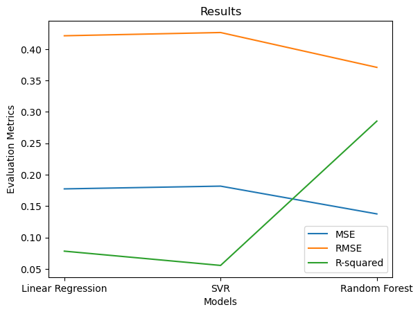

# 🌍 Earthquake Magnitude Prediction

## 📊 Project Overview

This project implements machine learning techniques to predict earthquake magnitudes using historical seismic data. By leveraging advanced regression algorithms, we aim to develop accurate predictive models that could potentially contribute to early warning systems and risk assessment strategies.

### Key Features

- **Multiple ML Models**: Implementation and comparison of Linear Regression (LR), Support Vector Regression (SVR), and Random Forest Regression (RFR).
- **Comprehensive Analysis**: Detailed evaluation of model performance with visualizations.
- **Data Preprocessing**: Robust handling of missing values and feature engineering.
- **Easy Reproducibility**: Well-documented code with clear instructions.

## 🔍 Motivation

Earthquakes are natural disasters that can cause significant damage and loss of life. Accurate prediction of earthquake magnitudes is crucial for:

- Developing effective early warning systems
- Improving disaster planning and response
- Enhancing risk assessment for vulnerable areas
- Advancing scientific understanding of seismic activity

## 📋 Dataset

The analysis is performed on the `Earthquake Data.csv` dataset which includes historical earthquake records with features such as:

- Geographical coordinates (latitude and longitude)
- Depth of the earthquake
- Time and date of occurrence
- Various seismic measurements
- Other relevant attributes

## 📈 Model Performance

After rigorous testing and evaluation, our comparative analysis revealed:



| Model              | MSE       | RMSE     | R² Score |
|--------------------|-----------|----------|----------|
| Linear Regression  | 0.177406  | 0.421196 | 0.078254 |
| SVM                | 0.181780  | 0.426357 | 0.055528 |
| Random Forest      | 0.137559  | 0.370890 | 0.285286 |


Among the three models evaluated—Linear Regression, SVM, and Random Forest—the Random Forest model performs the best.

**Key findings:**
- **Random Forest Regression (RFR)** demonstrated superior performance with the highest R² score and lowest error metrics
- **Support Vector Regression (SVR)** showed moderate predictive capability
- **Linear Regression (LR)** provided a useful baseline but was less effective for capturing the complex, non-linear relationships in seismic data

## 📊 Visualizations

### Feature Importance


### Multilinear Regression


### Residual Plot [Multilinear Regression]
![Residual Plot [Multilinear Regression]](results/Residual%20Plot.png)

### Support Vector Regression


### Residual Plot [Support Vector Regression]
![Residual Plot [Support Vector Regression]](results/Rersidual%20Plot%20[svm].png)

### Random Forest Regression


### Residual Plot [Random Forest Regression]
![Residual Plot [Random Forest Regression]](results/Residual%20Plot%20[%20RFR].png)

### Feature Importance Plot [Random Forest Regression]
![Feature Importance Plot [Random Forest Regression]](results/Fewature%20Referance%20Plot%20[RFR%20].png)

## 🛠️ Technologies Used

- **Python** - Primary programming language
- **Pandas & NumPy** - Data manipulation and numerical computations
- **Scikit-learn** - Implementation of machine learning algorithms
- **Matplotlib & Seaborn** - Data visualization
- **Jupyter Notebook** - Interactive development and documentation

## 💻 Installation and Usage

### Prerequisites
- Python 3.7+
- Jupyter Notebook/Lab

### Setup and Installation

1. Clone the repository:
```bash
git clone https://github.com/Hari-Krishnan-N/EarthQuake-ML_Magnitude_Prediction_System.git
cd Earthquake-Magnitude-Prediction
```

2. Install required dependencies.

3. Run the Jupyter Notebook:
```bash
jupyter notebook model_comparision.ipynb
```

### Workflow

1. **Data Exploration & Preprocessing**:
   - Load and examine the dataset
   - Handle missing values
   - Feature engineering and selection

2. **Model Training & Evaluation**:
   - Split data into training and testing sets
   - Train multiple regression models
   - Evaluate performance using metrics like RMSE, MAE, and R²

3. **Results Analysis**:
   - Compare model performances
   - Visualize predictions and errors
   - Generate insights and conclusions

## 🔮 Future Enhancements

- Implement deep learning models for potentially improved accuracy
- Incorporate real-time data feeds for dynamic predictions
- Develop a web application for interactive visualization
- Extend the analysis to specific geographic regions
- Add time-series analysis for temporal patterns

---
